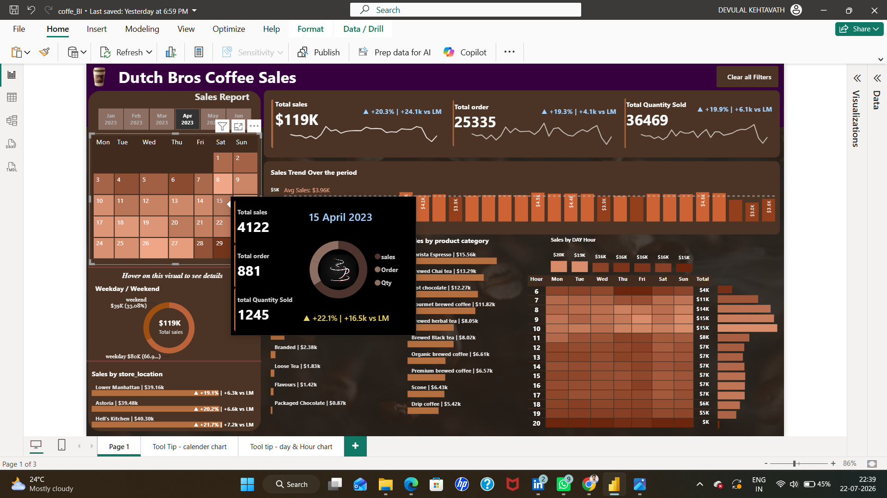

# ☕ Dutch Bros Coffee Sales Dashboard

---

## 📌 Project Overview

The **Dutch Bros Coffee Sales Dashboard** is an interactive Business Intelligence solution built in **Power BI** to analyze coffee shop sales performance. The dashboard transforms raw transactional data into actionable business insights using **Power Query**, **DAX**, and **interactive visualizations**. It enables stakeholders to monitor KPIs, identify top-performing products, evaluate store performance, analyze customer purchasing behavior, and make data-driven business decisions through dynamic filtering and real-time reporting.

---

## 📸 Dashboard Preview

---

## 📊 Key Metrics

| Metric | Value |
|---------|-------|
| 💰 Total Sales | **$119K** |
| 🛒 Total Orders | **25,335** |
| 📦 Quantity Sold | **36,469** |
| 📈 Sales Growth | **+20.3% vs Previous Month** |
| 📋 Orders Growth | **+19.3% vs Previous Month** |
| 📦 Quantity Growth | **+19.9% vs Previous Month** |

---

## 🚀 Dashboard Features

- 📈 Interactive KPI Cards
- 📅 Monthly Sales Analysis
- ☕ Product Category Performance
- 🏪 Store-wise Sales Analysis
- 🕒 Hourly Sales Heatmap
- 📊 Daily Sales Trend
- 📆 Calendar Slicer
- 📍 Weekday vs Weekend Comparison
- 🔍 Dynamic Filters & Cross Filtering

---

## 💡 Business Insights

- Coffee generated the highest revenue among all product categories.
- Weekday sales accounted for nearly **66%** of total revenue.
- Peak customer purchases occurred during morning business hours.
- Hell's Kitchen recorded the highest sales among all store locations.
- Sales showed consistent month-over-month growth across key KPIs.

---

## 🛠️ Technologies Used

- Microsoft Power BI
- Power Query
- DAX
- SQL
- Microsoft Excel

---

## 📂 Repository Contents

- `coffe_BI.pbix` – Power BI Dashboard
- `coffee_sales_pic.png` – Dashboard Screenshot
- `README.md`

---

## 👨‍💻 Author

### **Devulal Kethavath**

**Aspiring Data Analyst | Power BI Developer**

⭐ If you found this project useful, consider giving it a **Star** on GitHub.
