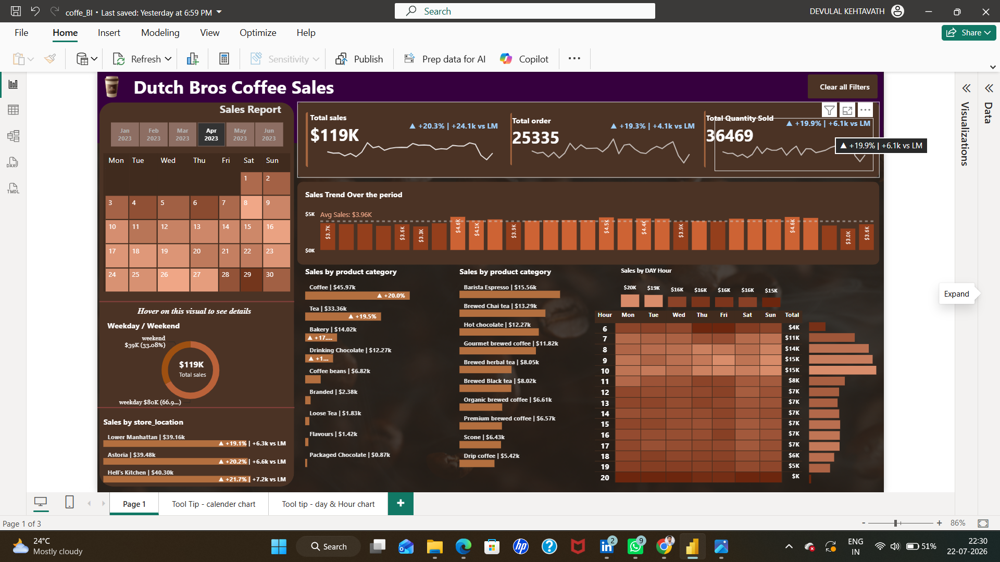

# ☕ Dutch Bros Coffee Sales Dashboard

An interactive Power BI dashboard that analyzes Dutch Bros Coffee sales, providing insights into sales performance, product categories, store locations, customer purchasing patterns, and key business KPIs through dynamic visualizations.

---

## 📸 Dashboard Preview

---

## 🚀 Features

- 📊 Interactive KPI Dashboard
- ☕ Product Category Analysis
- 🏪 Store Performance Analysis
- 📅 Sales Trend Analysis
- 🕒 Hourly Sales Heatmap
- 📈 Weekday vs Weekend Analysis
- 🎯 Dynamic Filters & Slicers

---

## 🛠️ Technologies Used

- Power BI
- Power Query
- DAX
- SQL
- Excel

---

## 📂 Project Files

- `coffe_BI.pbix` – Power BI Dashboard
- `coffee_sales_pic.png` – Dashboard Preview
- `README.md`

---

## 👨‍💻 Author

**Devulal Kethavath**

Aspiring Data Analyst | Power BI Developer

⭐ If you like this project, give it a **Star** on GitHub!
